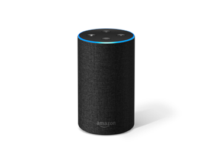

export { dark as theme } from 'mdx-deck/themes'
import { Invert, Split } from 'mdx-deck/layouts'
import { Image } from 'mdx-deck'
import { CodeSurfer } from "mdx-deck-code-surfer"

# Skip the small talk 
## Build a chatbot instead!
---
export default Split

# Jake Partusch

#### Omaha, NE
#### Principal Technologist - OPi
#### @JakePartusch

---
export default Split

## Object Partners, Inc. (OPi)
- Java, Groovy, Mobile, DevOps, Frontend
- ~100 Senior Consultants
- Omaha & Minneapolis
- Average tenure over 5 years
- Founded 1996
---
# What is a chatbot?
---
<Image src='https://media3.giphy.com/media/K6VhXtbgCXqQU/giphy.gif' />
---
# Chatbot
> "a computer program or an artificial intelligence which conducts a conversation via auditory or textual methods"
---
<Image src='https://cdn-images-1.medium.com/max/1024/1*e8v1xC0NTgoduh_ei9F7Pw.png'/>
---
export default Split

---
# So, how do we _build_ one?
---
<Image src='https://venturebeat.com/wp-content/uploads/2016/08/Bots-Landscape-v2-final.jpg' />
---
export default Invert

<Image src='https://media2.giphy.com/media/26u49YjOazMMAwTGU/giphy.gif'/>
---
# Lex
---
# Key Terms
- Intents
- Utterances
- Slots
- Fulfillment
---
export default Invert

---
# Connect
---
> "a simple to use, self-service, cloud-based customer contact center service."
---
export default Invert

---
# So...
---

---
# The Problem
- You are the "Pizza Person"
- You _love_ pizza 🍕
- You _loathe_ ordering it for every meeting
---
<Image src='https://media3.giphy.com/media/l4KhPbIIDgO3sMw0w/giphy.gif'/>
---
 # Chatbot!!
 1. Create a Lex bot to take the pizza order
 2. Integrate with your team's Slack channel
 3. ????
 4. Profit 
---
# The Lambda
---
## Features
- Accepts Toppings and Sizes
- Integrates with Lex
---
## Limitations
- Can only order one pizza
- Address and store locations are hard-coded
---
## Tech Stack
- TypeScript
- Deployed with Servlerless.io
- https://github.com/JakePartusch/pizza-bot-lambda
---
<CodeSurfer
  title="Lex Request/Response"
  code={require("!raw-loader!./lex.ts")}
  lang="typescript"
  showNumbers={false}
  dark={false}
  steps={[
    { lines: [3] },
    { range: [4, 8] },
    { range: [12, 16] },
    { lines: [21] },
    { lines: [24] },
    { lines: [25] },
    { range: [27, 32] },
    { lines: [33] },
    { range: [34, 37] },
  ]}
/>
---
---
<CodeSurfer
  title="Order Pizza Lambda"
  code={require("!raw-loader!./lambda.ts")}
  lang="typescript"
  showNumbers={false}
  dark={false}
  steps={[
    { range: [6, 7] },
    { range: [11, 12] },
    { range: [14, 15] },
    { range: [17, 18] },
    { range: [21, 23] },
    { range: [25, 28] },
    { lines: [30] },
    { range: [31, 36] },
  ]}
/>
---
# Demo
---
 ## Extra Credit
 1. Create a Lex bot to take the pizza order
 2. Handle phone calls with Connect
 3. ????
 4. Profit 
---
<Image src='https://i.giphy.com/media/l0HlRnAWXxn0MhKLK/giphy.webp' />
---
<Image src='https://i.giphy.com/media/6tHy8UAbv3zgs/giphy.webp' />